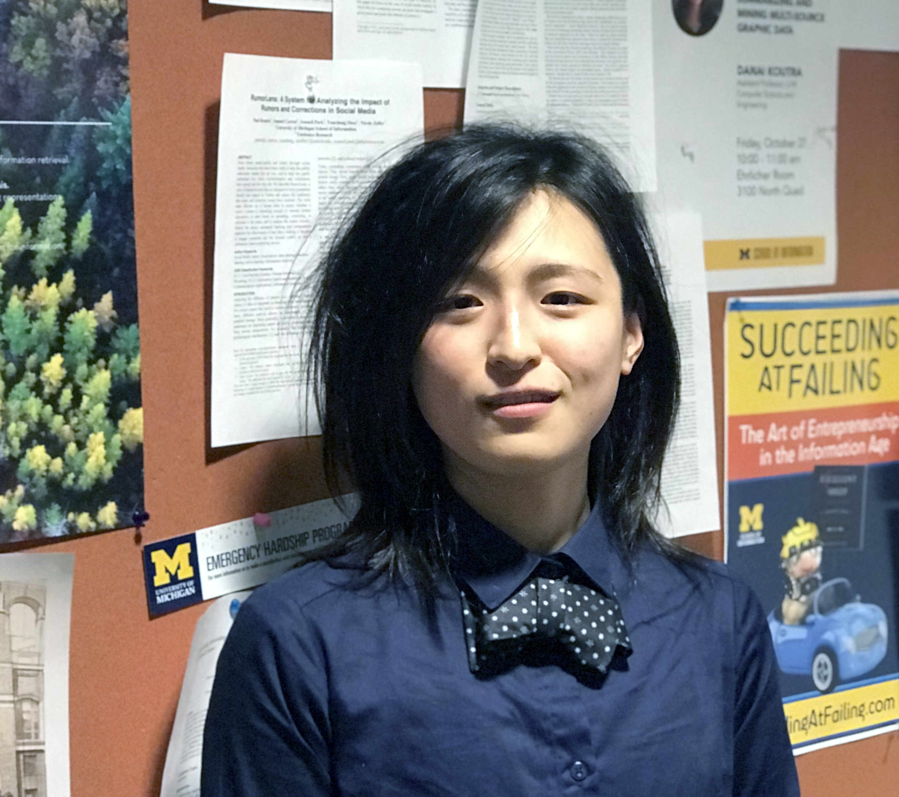



	

		
	

	

	

    

            <h3>RESEARCH INTEREST</h3>
            
I'm broadly interested in data science for social good, and I'm particularly interested in complex sociotechnological systems with vast user-generated content. Thus far, I have published numerous manuscripts in the field of misinformation and online political communications. My projects rely on extensive social media datasets and a diverse range of computational methods including natural language processing (topic modeling, word2vec, entity extraction, NLTK, BERT), network analysis (centrality, network cascade, network inference, motifs), machine learning (scikit-learn, Tensorflow), and statistical analysis. My PI is <a href="http://cbudak.com/index.html">Ceren Budak</a>.

            <dt><strong>Email:</strong> lbozarth AT umich DOT edu</dt>
            <dt><strong>Social Media:</strong>
            
            
            
            </dt>
    

    <h3>SHORT BIO</h3>
    
I grew up in the West Coast, and earned my bachelors in Computer Science from the University of Washington, Seattle. I then worked at Amazon and Google as a full stack software engineer for a few years. Recently, I earned my PhD from the University of Michigan, School of Information. I'm currently working as a Data Engineer at the Center for Informed Public (CIP) at the University of Washignton, Seattle

    
Outside of work, I enjoy basketball, badminton, running, weight lifting, horror films, Dungeons and Dragons with my close friends, and teaching my pets new tricks. I have also solo backpacked in Asia and Europe for half a year, and contemplated being a wandering comedian for a time.

<h3>PUBLICATIONS</h3>
<h4>Misinformation Papers</h4>
<ol>
<li>
Lia Bozarth, Ceren Budak, <i>"Market Forces: Quantifying the Role of Top Credible Ad Servers in the Fake News Ecosystem"</i>, in proceedings, ICWSM (2021) <a href="https://lbozarth.github.io/assets/static/adsICWSM.pdf">Download</a>

</li>
<li>
Lia Bozarth, Ceren Budak, <i>"An Analysis of the Partnership between Retailers and Low-credibility News Publishers"</i>, in proceedings, JQD:DM (2021) <a href="https://lbozarth.github.io/assets/static/ads_jqddm.pdf">Download</a>

</li>
<li>
Robert Bond, Lia Bozarth, Ceren Budak, Kelly Garrett, Jason Jones, Drew Margolin, <i>"The Case for Studying Obscure Falsehoods"</i>, <a href="https://lbozarth.github.io/assets/static/harvard.pdf" >Harvard Kennedy School Misinformation Review (2021)</a>

</li>
<li>
Lia Bozarth, Ceren Budak, <i>"Toward a Better Performance Evaluation Framework for Fake News Classification"</i>, in proceedings, ICWSM(2020).<a href="https://lbozarth.github.io/assets/static/clf_eval.pdf">Download</a>

</li>
<li>
Lia Bozarth, Aparajita Saraf, Ceren Budak, <i>"Higher Ground? How Groundtruth Labeling Impacts Our Understanding of Fake News about the 2016 U.S. Presidential Nominees"</i>, in proceedings, ICWSM (2020). <a href="https://lbozarth.github.io/assets/static/groundtruth.pdf">Download</a>

</li>
</ol>
<h4>Political Communication on Social Media Papers</h4>
<ol>
<li>
Lia Bozarth, Ceren Budak, "Keyword Expansion Techniques for Mining Social Movement Data on Social Media", EPJ Data Science (2022) <a href="https://lbozarth.github.io/assets/static/keywords.pdf">Download</a>

</li>
<li>
Chris Quarles, Lia Bozarth “How the Term 'White Privilege' Affects Online Communication", PLOS One (2022) <a href="https://lbozarth.github.io/assets/static/wp.pdf">Download</a>

</li>
<li>
Lia Bozarth, Ceren Budak, "Beyond the Eye-Catchers: a Large-Scale Study of Social Movement Organizations' Involvement in Online Protests", in proceedings, New Media & Society (2020). <a href="https://lbozarth.github.io/assets/static/NMS2020.pdf">Download</a>

</li>
<li>
Lia Bozarth, Anmol Panda, Joyojeet Pal, "From Greetings to Corruption: Politicians, Political Parties, and Tweeting in India", in proceedings, ICTD (2020) <a href="https://lbozarth.github.io/assets/static/corruption.pdf">Download</a>

</li>
<li>
Lia Bozarth, Joyojeet Pal, "Twitter Discourse as a Lens into Politicians' Interest in Technology and Development", in proceedings, ICTDX (2018). <a href="https://lbozarth.github.io/assets/static/ICTDX_poster.pdf">Download</a>

</li>
<li>
Lia Bozarth, Ceren Budak, "Is Slacktivism Underrated? Measuring the Value of Slacktivists for Online Social Movements", in proceedings, ICWSM (2017). <a href="https://lbozarth.github.io/assets/static/slack.pdf">Download</a>

</li>
</ol>

<h3>MANUSCRIPTS UNDER REVIEW</h3>
<ol>
<li>
Ceren Budak, Robert Bond, Lia Bozarth, Kelly Garrett, Jason Jones, Drew Margolin, “Bursts of Co-publication Among High and Low Credibility Online News Publishers Observed on Facebook”, submitted to Science Advances

</li>
</ol>

<h3>AWARDS</h3>

Best Poster Award: Lia Bozarth, Ceren Budak, "Profit for You and Me: Exploring Ad Servers on Fake News Sites", for the category "Most Likely to Make a Societal Impact", MIDAS Data Symposium (2019) <a href="https://midas.umich.edu/2019-symposium-winners/">Award Link</a>

Best Poster Award Honorable Mention: Lia Bozarth, Ceren Budak, “A Large-scale Study of Social Movement Organizations (SMOs) in Online Movements”,, MIDAS TweetCon (2019)

<h3>IN THE PRESS</h3>

Joyojeet Pal, Lia Bozarth, "How Modi lost his mojo and Rahul roared to life on Twitter", Quartz (2018). <a href="https://qz.com/india/1441312/how-narendra-modi-rahul-gandhi-have-performed-on-indian-twitter/">Article Link</a>

Joyojeet Pal, Lia Bozarth, "Is Tweeting in Indian Languages Helping Politicians Widen Their Reach?", Economic and Political Weekly (2018). <a href="https://lbozarth.github.io/assets/static/epw_01.pdf">Download</a>

<h3>ACADEMIC SERVICES</h3>

Graduate Student Instructor (GSI) at the University of Michigan for the following courses: Data Mining I, Data Mining II, Information Architecture, Fundamentals of Human Behavior, and  Information Analytics Project.

Reviewer for the following venues: ICWSM, CSCW, New Media & Society, and WWW.

Coordinator for the Computational Social Science Methods (CSSM) Reading Group at UMSI.

Facilitator (Organizer) for UMSI's <i>LGBTQ</i> student group.

Student representative within the <i>Student Life</i> and <i>Academic Affairs</i> subcommittees in Rackham Student Government at the University level.

