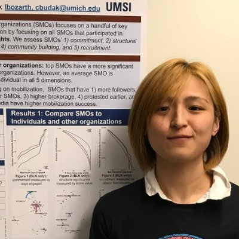



	

		
	

	

        <h3>Short Biography</h3>
        
Hi, I'm Lia. I grew up in the West Coast and earned my bachelors in computer science from the University of Washington, Seattle. Post undergrad, I worked in the industry (Amazon &amp; Google) as a software engineer for a few years. I'm currently a 5th year doctoral candidate at University of Michigan, School of Information. My advisor is <a href="http://cbudak.com/index.html">Ceren Budak</a>.

            

                <dl>
                <dt>Contact Information</dt>
                <dd>Email: lbozarth AT umich DOT edu</dd>
                            
                            
                            
                </dl>
		

	

<h3>Research Interest</h3>

I'm interested in applying computational methods to study and improve communication quality between heterogeneous actors on social media. I have worked 3 years as a full-stack software developer at top-tier tech firms, followed by 4 years of research experience in the field of computational social science. I have published numerous manuscripts in the field of fake news, online social movements, news media studies, and political communications.

<h3>Publications</h3>

Lia Bozarth, Ceren Budak, "Market Forces: Quantifying the Role of Top Credible Ad Servers in the Fake News Ecosystem", forthcoming, ICWSM (2021) <a href="https://lbozarth.github.io/assets/static/adsICWSM.pdf">Download</a>

Lia Bozarth, Ceren Budak, "Beyond the Eye-Catchers: a Large-Scale Study of Social Movement Organizations' Involvement in Online Protests", in proceedings, New Media & Society (2020). <a href="https://lbozarth.github.io/assets/static/NMS2020.pdf">Download</a>

Lia Bozarth, Ceren Budak, "Toward a Better Performance Evaluation Framework for Fake News Classification", in proceedings, ICWSM(2020).<a href="https://lbozarth.github.io/assets/static/clf_eval.pdf">Download</a>

Lia Bozarth, Aparajita Saraf, Ceren Budak, "Higher Ground? How Groundtruth Labeling Impacts Our Understanding of Fake News about the 2016 U.S. Presidential Nominees", in proceedings, ICWSM (2020). <a href="https://lbozarth.github.io/assets/static/groundtruth.pdf">Download</a>

Lia Bozarth, Anmol Panda, Joyojeet Pal, "From Greetings to Corruption: Politicians, Political Parties, and Tweeting in India", in proceedings, ICTD (2020) <a href="https://lbozarth.github.io/assets/static/corruption.pdf">Download</a>

Lia Bozarth, Joyojeet Pal, "Twitter Discourse as a Lens into Politicians' Interest in Technology and Development", in proceedings, ICTDX (2018). <a href="https://lbozarth.github.io/assets/static/ICTDX_poster.pdf">Download</a>

Lia Bozarth, Ceren Budak, "Is Slacktivism Underrated? Measuring the Value of Slacktivists for Online Social Movements", in proceedings, ICWSM (2017). <a href="https://lbozarth.github.io/assets/static/slack.pdf">Download</a>

<h3>Awards, Articles, and In the Press</h3>

Robert Bond, Lia Bozarth, Ceren Budak, Kelly Garrett, Jason Jones, Drew Margolin, "The Case for Studying Obscure Falsehoods." forthcoming, Harvard Kennedy School Misinformation Review (2021)

Lia Bozarth, Ceren Budak, "Profit for You and Me: Exploring Ad Servers on Fake News Sites", best poster for the category "Most Likely to Make a Societal Impact", MIDAS Data Symposium (2019) <a href="https://midas.umich.edu/2019-symposium-winners/">Award Link</a>

Lia Bozarth, Ceren Budak, “A Large-scale Study of Social Movement Organizations (SMOs) in Online Movements”, best poster honorable mention, MIDAS TweetCon (2019)

Joyojeet Pal, Lia Bozarth, "How Modi lost his mojo and Rahul roared to life on Twitter", Quartz (2018). <a href="https://qz.com/india/1441312/how-narendra-modi-rahul-gandhi-have-performed-on-indian-twitter/">Article Link</a>

Joyojeet Pal, Lia Bozarth, "Is Tweeting in Indian Languages Helping Politicians Widen Their Reach?", Economic and Political Weekly (2018). <a href="https://lbozarth.github.io/assets/static/epw_01.pdf">Download</a>

<h3>Academic Service</h3>

Graduate Student Instructor (GSI) at University of Michigan

Coordinator for the Computational Social Science Methods (CSSM) Reading Group at UMSI

Served as facilitator for SI's <i>LGBTQ</i> student group.

Served as a student representative within the <i>Student Life</i> and <i>Academic Affairs</i> subcommittees in Rackham Student Government at the University level. 

